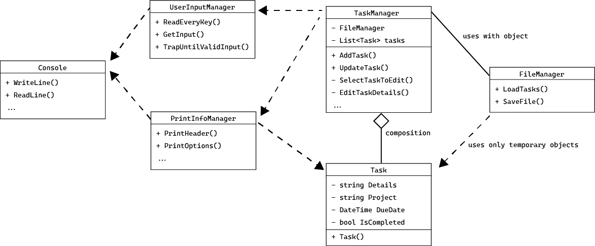

This is a simple app that allows users to add/update/remove and save tasks to file.

It consists of three parts:

1. Main menu
2. Add tasks
3. Edit tasks

The code has five classes and a main (Program.cs):

1. Task.cs
2. TaskManager.cs
3. FileManager.cs
4. PrintInfoManager.cs
5. UserInputManager.cs

# Instructions
Follow instructions in terminal, when running Program.cs.

# UML - Classes

### 1. TaskManager
  * **Fields**
    * FileManager fManager
    * List<Task> tasks
  * **Methods**
    * AddTask()
    * UpdateTask()
    * SelectTaskToEdit(Task task, ref string? selectedProject)
    * EditTaskDetails(int fieldIndex, Task task, string[] fields, ref string? selectedProject)
    * SearchForTask()
    * ShowProjectSelect()
    * CalcPageLayout(...)
    * FilterOptions(...)
    * UserAction(...)
    * HandleEnter(...)
    * HandleDeleteKey(...)
    * HandleFKey(...)
    * HandlePKey(...)
    * HandleAKey(...)
    * HandleSKey(...)

### 2. FileManager
  * **Methods**
    * SaveFile(string fileName, List<Task> tasks)
    * LoadTasks(string filePath)

### 3. Task
  * **Fields**
    * **string** _Details_
    * **string** _Project_
    * **DateTime** _DueDate_
    * **bool** _IsCompleted_

### 4. UserInputManager
  * **Methods**
    * static string GetInput(string prompt, string errorMessage, bool allowEmpty)
    * static ConsoleKey TrapUntilValidInput(int mode)
    * static string ReadEveryKey()

### 5. PrintInfoManager
  * **Methods**
    * static string SetBanner(...)
    * static void PrintHeader(string message)
    * void PrintWelcome(int complete, int pending)
    * static void PrintOptions()
    * static void PrintAddTaskInfo(int step)
    * static void PrintWithColor(string message, ConsoleColor color)
    * static void PrintTableHead()
    * static void PrintTableRows(List<Task> tasks, int selectedIndex)
    * static void PrintSortingOptions(bool showCompletedTasks)
    * static void PrintUpdateTaskFields(string[] fields, Task task, int fieldIndex)
    * static void PrintUpdateTaskInfo()
    * static void PrintInvalidDate()
    * static void PrintInvalidDateEarly()
    * static void PrintDeleteConfirm()
    * static void PrintDeleteCancel()
    * static void PrintProjectList(ref List<string> projects, ref int selectedIndex)
    * static void PrintAreUSure(Task task)

# UML - Relashionships and associations

1. **TaskManager** _uses_:
    * **FileManager** to save and load data, with an object. 
    * **PrintInfoManager** to print information, data, user input and output, to console. Without objects.
    * **UserInputManager** to handle user input. Without objects.
2. **TaskManager** has a composition rellationship with **Task**.Since it manages a list of **Task** objects
3. **Task** is a simple data model class with fields for the task details to be saved.
4. **PrintInfoManager** and **UserInputManager** are utility classes.
5. **PrintInfoManager** and **FileManager** _use_ objects of **Task** to get data.

